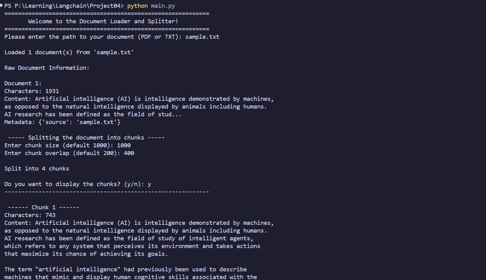

# Document Loaders and Text Splitters with LangChain

Load a local `.txt` or `.pdf` file, inspect the raw document output, and split it into overlap-aware chunks using LangChain.

This project is a clean, beginner-friendly CLI demonstration of the first two building blocks in a Retrieval-Augmented Generation (RAG) workflow:

- Document loading
- Text chunking

---

## Why This Project Matters

Before embeddings, vector databases, and retrieval chains, you need well-structured text input.

This project helps you understand:

- How file loaders convert source documents into LangChain `Document` objects
- How chunk size and overlap affect context continuity
- How metadata stays attached through splitting

---

## Features

- Supports `.txt` and `.pdf` inputs
- Uses `TextLoader` and `PyPDFLoader` from `langchain_community`
- Splits documents with `RecursiveCharacterTextSplitter`
- Interactive CLI for chunk parameters
- Optional chunk preview mode (show all chunks or just first/last)
- Includes sample content and output screenshot

---

## Project Structure

```text
.
├── main.py          # CLI entry point
├── loader.py        # File loading logic (.txt / .pdf)
├── splitter.py      # Chunking logic
├── sample.txt       # Example input document
├── assets/
│   └── output.png   # Example CLI run
└── README.md
```

---

## Requirements

- Python 3.10+
- pip

Recommended packages:

- `langchain-community`
- `langchain-text-splitters`
- `python-dotenv`
- `pypdf` (required by `PyPDFLoader`)

---

## Installation

```bash
git clone <your-repo-url>
cd Langchain-P4-Document-Loaders-and-Text-Splitters

python -m venv .venv
source .venv/bin/activate

pip install -U pip
pip install langchain-community langchain-text-splitters python-dotenv pypdf
```

Optional `.env` support is enabled in `main.py` through `load_dotenv()`. You can add a `.env` file if needed for future extensions.

---

## How to Run

```bash
python main.py
```

You will be prompted for:

1. Document path (`.pdf` or `.txt`)
2. Chunk size (default: `1000`)
3. Chunk overlap (default: `200`)
4. Whether to display all chunks (`y/n`)

### Quick demo with included sample

```text
Please enter the path to your document (PDF or TXT): sample.txt
Enter chunk size (default 1000): 1000
Enter chunk overlap (default 200): 400
Do you want to display the chunks? (y/n): y
```

---

## Example Output



---

## How It Works

### 1) Load the document

`loader.py` inspects the file extension and chooses:

- `PyPDFLoader` for `.pdf`
- `TextLoader` for `.txt`

It then returns a list of LangChain `Document` objects via `loader.load()`.

### 2) Split into chunks

`splitter.py` configures `RecursiveCharacterTextSplitter` with user-provided:

- `chunk_size`
- `chunk_overlap`

Then it calls `split_documents(documents)` and returns chunked `Document` objects.

### 3) Display output

`main.py` prints:

- Raw document statistics and preview
- Number of chunks created
- Either all chunks or only first/last chunk previews

---

## Notes and Current Limitations

- Input validation is minimal.
- Unsupported extensions are not currently handled with a custom error message.
- Very large files may produce many chunks and large console output.

---

## Suggested Next Steps

- Add validation and friendly error handling for invalid paths/extensions
- Add Markdown/Docx loaders
- Add token-based splitting strategy
- Embed chunks and store them in a vector database
- Build a retrieval + QA pipeline on top of these chunks

---

## License

Add your preferred license (MIT, Apache-2.0, etc.) in a `LICENSE` file.
